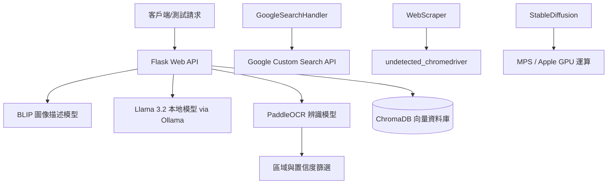

# Python_Demo

> 這是一個整合了影像描述生成 (Image Captioning)、圖像生成 (Image Generation)、光學字元辨識 (OCR)、本地端大語言模型 (LLM) 問答、語意搜尋 (ChromaDB) 及網路爬蟲的整合型 Python AI 範例專案。

## 概述

本專案旨在展示如何靈活運用當前主流的 AI 模型與開源套件，包含使用 Salesforce BLIP 進行圖片內容描述、PaddleOCR 進行光學字元辨識、Stable Diffusion 進行高品質圖像生成，以及利用 ChromaDB 實現語意向量資料檢索。同時，專案結合 Flask Web 框架提供 RESTful APIs，並能搭配 Docker 部署的本地 Ollama Llama 3.2 服務，實現高度隱私且可離線執行的生成式 AI 多模態問答與關鍵字 Google 搜尋整合。

## 架構

本專案的高階架構如下圖所示：



## 專案結構

```
Python_Demo/
├── VectorDataBase/                # 向量資料庫相關範例
│   ├── ChromaDB.py                # 使用預設 MiniLM 模型與持久化儲存的 ChromaDB 範例
│   └── ChromaDB_mpnetModel.py     # 使用 SentenceTransformer mpnet 模型的 ChromaDB 範例
├── BLIP_Model.py                  # Salesforce BLIP 圖片描述生成與異步中文翻譯測試腳本
├── Flask_BLIP.py                  # 提供圖像描述生成與翻譯服務的 Flask API 伺服器
├── Flask_Llama_BLIP_Basic.py      # 整合 BLIP 與 Llama 3.2 問答服務的基礎 Flask API
├── Flask_Llama_BLIP_Performance.py# 支援純文字或圖片混合輸入的進階問答 Flask API
├── Flask_OCR.py                   # 整合 PaddleOCR 並過濾結果的圖像文字辨識 Flask API
├── GoogleSearchHandler.py         # 結合結巴分詞 (Jieba) 與 Google 搜尋的關鍵字檢索工具
├── PaddleOCR_Model.py             # 本地端 PaddleOCR 文字辨識測試腳本
├── StableDiffusion.py             # 使用 Stable Diffusion 在 MPS 設備上生成圖像的腳本
├── WebScraper.py                  # 使用無偵測 Chrome 驅動的 Google 搜尋結果網頁爬蟲
├── diffusionTransform.py          # 將 Stable Diffusion 單一權重檔案轉換為 Diffusers 格式的工具
├── PythonEnvSetting.txt           # 本地 Python 虛擬環境 conda 設定指引
├── ollamaCommendLine.txt          # 使用 Docker 部署 Ollama 與 Llama3.2 模型的指令說明
└── Test_RequestAPI.txt            # 提供 API 介面測試的 HTTP 請求範例指引
```

## 快速開始

### 前置需求
- **Python**: 3.9+ 建議使用 Conda 進行環境管理。
- **Docker**: 運作 Ollama 本地模型所需。
- **硬體加速（選用）**: macOS (M 系列晶片，支援 MPS) 或 NVIDIA GPU (支援 CUDA)，用以加速本地 Stable Diffusion 與 BLIP 推理。

### 本機執行

1. **建立並啟用虛擬環境**
   ```bash
   conda create -n myenv python=3.9
   conda activate myenv
   ```

2. **安裝所需套件**
   ```bash
   pip install flask transformers pillow googletrans==4.0.0-rc1 requests paddlepaddle paddleocr undetected-chromedriver diffusers torch chromadb sentence-transformers python-dotenv jieba
   ```

3. **啟動 Ollama 服務與 Llama 3.2 模型 (問答服務必需)**
   ```bash
   # 下載並啟動 Ollama 容器
   docker run -d -v ollama:/root/.ollama -p 11434:11434 --name ollama ollama/ollama
   
   # 下載並執行 Llama 3.2 3B 模型
   docker exec -it ollama ollama run llama3.2:3B
   ```

4. **執行 Web API 伺服器**
   您可以啟動不同的 API 服務，例如進階版的多模態問答 API：
   ```bash
   python Flask_Llama_BLIP_Performance.py
   ```

5. **測試 API 連線**
   參考 [Test_RequestAPI.txt](./Test_RequestAPI.txt) 發送測試請求：
   ```bash
   curl -X POST http://localhost:5001/ask \
     -F "question=介紹一下這張圖片" \
     -F "image=@/path/to/your/image.jpg"
   ```

### 組態設定

專案讀取環境變數與內部設定檔，主要參數如下：

| 設定項目 | 說明 | 預設值 / 來源 |
|----------|------|--------------|
| `MAX_CONTENT_LENGTH` | Flask 檔案上傳的最大容量限制 | `10 * 1024 * 1024` (10MB) |
| `OLLAMA_API_URL` | Ollama 伺服器的 HTTP 請求連接埠 | `http://localhost:11434/api/generate` |
| `API_KEY` | Google 自訂搜尋 API 金鑰 | 讀取自 `.env` 中的 `API_KEY` |
| `SEARCH_ENGINE_ID` | Google 自訂搜尋引擎 ID | 讀取自 `.env` 中的 `SEARCH_ENGINE_ID` |

## 核心元件

- **[BLIP_Model.py](./BLIP_Model.py)**: 使用 `Salesforce/blip-image-captioning-base` 模型對指定圖片進行描述生成，並利用 `googletrans` 異步翻譯為繁體中文。
- **[Flask_BLIP.py](./Flask_BLIP.py)**: 暴露 `/caption` 端點以接受 POST 上傳圖片，並回傳英、中雙語的圖像描述。
- **[Flask_Llama_BLIP_Basic.py](./Flask_Llama_BLIP_Basic.py)**: 提供 `/ask` 端點，當接收到圖片與問題時，先使用 BLIP 分析圖片，再將圖片描述與使用者的問題傳遞給本地的 Llama 3.2 進行繁體中文的問答。
- **[Flask_Llama_BLIP_Performance.py](./Flask_Llama_BLIP_Performance.py)**: 為基礎問答 API 的優化版，支援純文字、純圖片或兩者混合的彈性輸入。
- **[Flask_OCR.py](./Flask_OCR.py)**: 整合 `PaddleOCR` 進行圖像文字識別的 API 服務，回傳過濾後的文字。
- **[PaddleOCR_Model.py](./PaddleOCR_Model.py)**: 封裝 `PaddleOCR` 識別流程，內建依據文字塊之中心座標位置調整信賴度閾值的過濾邏輯。
- **[GoogleSearchHandler.py](./GoogleSearchHandler.py)**: 使用 `jieba` 分詞提取使用者問題中的關鍵詞，並呼叫 Google Custom Search API 獲取前 3 筆網頁結果摘要。
- **[WebScraper.py](./WebScraper.py)**: 使用 `undetected-chromedriver` 模擬真實瀏覽器行為進行 Google 搜尋結果的網頁爬取，可有效規避自動化檢測。
- **[ChromaDB.py](./VectorDataBase/ChromaDB.py)**: 使用預設的 `all-MiniLM-L6-v2` 嵌入模型，建立並檢索本地向量資料庫的示範腳本。
- **[ChromaDB_mpnetModel.py](./VectorDataBase/ChromaDB_mpnetModel.py)**: 載入較強大的 `all-mpnet-base-v2` 嵌入模型以展示更精準的語意向量比對範例。

## 運作流程

以進階多模態問答 (`Flask_Llama_BLIP_Performance.py` 的 `/ask`) 為例：

1. **接收請求**：客戶端透過 HTTP POST 傳遞 `image`（圖片檔案，非必填）與 `question`（提問文字，非必填）。
2. **圖像描述提取**：若有上傳圖片，API 載入圖片並調用 BLIP 模型生成英文描述，並透過 `googletrans` 同步翻譯為繁體中文描述。
3. **提示詞構建**：將翻譯好的圖像描述與使用者的原始問題進行拼裝。若無上傳圖片，則僅保留使用者問題。
4. **本地 LLM 推理**：建構 Prompt（例如 `圖片描述：... 問題：... 只能用繁體中文自然回答問題。`）並 POST 至本地 Ollama 服務的 Llama 3.2 模型。
5. **回傳回答**：API 收到 Llama 3.2 的回覆後，格式化為 JSON 物件並回傳給客戶端。

## 設計決策

1. **本地化隱私優先**：
   在處理 LLM 推理時，選擇將 Llama 3.2 運行在本地 Docker 的 Ollama 中，這能確保用戶上傳的資料不會傳遞到外部伺服器，適合隱私敏感性高的應用場景。

2. **基於區域的 OCR 置信度動態篩選**：
   在 [PaddleOCR_Model.py](./PaddleOCR_Model.py) 中，為了減少背景雜訊引起的誤判，設計了 `get_threshold(x, y)` 規則：
   - 頂部區域 ($y < 200$) 或左側邊緣 ($x < 200$) 通常為非核心文字區，設定較高的過濾閾值（0.8 / 0.85）。
   - 底部區域 ($y > 800$) 與右側邊緣 ($x > 800$) 分別設定 0.7 與 0.9。
   - 其他核心區域設定較寬鬆的 0.75 閾值。
   這種動態設定能有效過濾掉無意義的噪聲字元。

3. **模型記憶體清理與釋放**：
   為了避免在沒有專用伺服器的本機環境中造成顯示記憶體 (VRAM) 溢出，部分測試腳本（如 [BLIP_Model.py](./BLIP_Model.py) 與 [StableDiffusion.py](./StableDiffusion.py)）在生成結束後明確執行了垃圾回收 `gc.collect()` 與 `torch.mps.empty_cache()`，以主動回收 GPU/MPS 資源。
