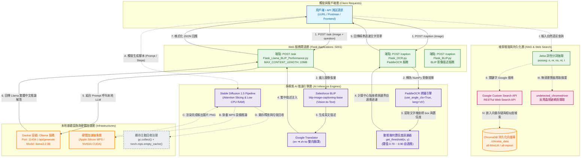

# Python_Demo

> **整合多模態視覺模型 (BLIP)、空間自適應 OCR (PaddleOCR)、本地端大語言模型 (Ollama Llama 3.2)、語意向量檢索 (ChromaDB) 與圖像生成 (Stable Diffusion) 的全方位 AI 示範平台。**

---

## 系統架構

本專案整合 Flask 微服務、本機容器化 LLM、邊緣/本地端多模態視覺推論模型與向量資料庫。整體架構分為**請求層**、**Web API 服務層**、**AI 推論引擎層**、**基礎設施與加速層**以及**檢索持久化層**：


```mermaid
flowchart TB
    %% 節點樣式定義
    classDef clientStyle fill:#E1F5FE,stroke:#0288D1,stroke-width:2px,color:#01579B;
    classDef apiStyle fill:#E8F5E9,stroke:#388E3C,stroke-width:2px,color:#1B5E20;
    classDef aiModelStyle fill:#EDE7F6,stroke:#512DA8,stroke-width:2px,color:#311B92;
    classDef infraStyle fill:#FFF3E0,stroke:#F57C00,stroke-width:2px,color:#E65100;
    classDef extStyle fill:#FCE4EC,stroke:#C2185B,stroke-width:2px,color:#880E4F;
    classDef cleanStyle fill:#ECEFF1,stroke:#607D8B,stroke-width:2px,stroke-dasharray: 5 5,color:#37474F;

    %% 請求客戶端層
    subgraph SubClient ["觸發與客戶端層 (Client Requests)"]
        ClientUser["用戶端 / API 測試請求<br/>(cURL / Postman / Frontend)"]:::clientStyle
    end

    %% Web API 閘道層
    subgraph SubGateway ["Web 服務閘道層 (Flask Applications :5001)"]
        EndpointAsk["端點: POST /ask<br/>Flask_Llama_BLIP_Performance.py<br/>MAX_CONTENT_LENGTH: 10MB"]:::apiStyle
        EndpointOCR["端點: POST /caption<br/>Flask_OCR.py<br/>PaddleOCR 服務"]:::apiStyle
        EndpointCaption["端點: POST /caption<br/>Flask_BLIP.py<br/>BLIP 影像描述服務"]:::apiStyle
    end

    %% 核心推論引擎層
    subgraph SubEngine ["多模態 AI 推論引擎層 (AI Inference Engines)"]
        BLIPModel["Salesforce BLIP<br/>blip-image-captioning-base<br/>(Vision-to-Text)"]:::aiModelStyle
        TranslatorModule["Google Translator<br/>(en ➔ zh-tw 雙向翻譯)"]:::aiModelStyle
        PaddleEngine["PaddleOCR 辨識引擎<br/>(use_angle_cls=True, lang='ch')"]:::aiModelStyle
        SpatialFilter["動態幾何置信度過濾器<br/>get_threshold(x, y)<br/>(閾值 0.70 ~ 0.90 自適應)"]:::aiModelStyle
        StableDiffEngine["Stable Diffusion 1.5 Pipeline<br/>(Attention Slicing & Low CPU RAM)"]:::aiModelStyle
    end

    %% 本地基礎設施與硬體層
    subgraph SubInfra ["本地基礎設施與硬體加速層 (Infrastructures)"]
        DockerOllama["Docker 容器: Ollama 服務<br/>Port: 11434 | /api/generate<br/>Model: llama3.2:3B"]:::infraStyle
        HardwareAccel["硬體加速抽象層<br/>(Apple Silicon MPS / NVIDIA CUDA)"]:::infraStyle
        MemClean["顯存主動回收治理<br/>gc.collect() + torch.mps.empty_cache()"]:::cleanStyle
    end

    %% 儲存與檢索增強層
    subgraph SubRAG ["檢索增強與持久化層 (RAG & Web Search)"]
        JiebaExtract["Jieba 詞性分詞抽取<br/>posseg: n, nr, ns, nt, t"]:::apiStyle
        GoogleSearchAPI["Google Custom Search API<br/>RESTful Web Search API"]:::extStyle
        WebScraperUC["undetected_chromedriver<br/>反爬蟲規避網頁擷取"]:::extStyle
        ChromaStore[("ChromaDB 持久化向量庫<br/>./chroma_data<br/>all-MiniLM / all-mpnet")]:::infraStyle
    end

    %% 鏈路 1: 多模態圖文問答主流 (步驟 1~7)
    ClientUser -->|"1. POST /ask (image + question)"| EndpointAsk
    EndpointAsk -->|"2. 載入圖像張量"| BLIPModel
    BLIPModel -->|"3. 生成英文描述"| TranslatorModule
    TranslatorModule -->|"4. 繁中描述注入"| EndpointAsk
    EndpointAsk -->|"5. 組合 Prompt 呼叫本地 LLM"| DockerOllama
    DockerOllama -->|"6. 回傳 Llama 繁體中文推論解答"| EndpointAsk
    EndpointAsk -->|"7. 格式化 JSON 回應"| ClientUser

    %% 鏈路 2: 空間置信度 OCR 辨識流 (步驟 1~5)
    ClientUser -->|"1. POST /caption (image)"| EndpointOCR
    EndpointOCR -->|"2. 轉為 NumPy 影像矩陣"| PaddleEngine
    PaddleEngine -->|"3. 提取文字塊座標 box 與置信度"| SpatialFilter
    SpatialFilter -->|"4. 計算中心點座標與邊界自適應過濾"| EndpointOCR
    EndpointOCR -->|"5. 回傳精準過濾文字清單"| ClientUser

    %% 鏈路 3: 圖像生成與資源回收流 (步驟 A~D)
    ClientUser -.->|"A. 觸發生成腳本 (Prompt / Steps)"| StableDiffEngine
    StableDiffEngine -.->|"B. 掛載 MPS 設備推論"| HardwareAccel
    HardwareAccel -.->|"C. 渲染完成輸出圖片 PNG"| StableDiffEngine
    StableDiffEngine -.->|"D. 顯存釋放與垃圾回收"| MemClean

    %% 鏈路 4: 智慧搜尋與向量資料庫流 (步驟 I~IV)
    ClientUser -.->|"I. 輸入自然語言查詢"| JiebaExtract
    JiebaExtract -.->|"II. 關鍵字 Google 搜尋"| GoogleSearchAPI
    JiebaExtract -.->|"III. 無頭瀏覽器爬取摘要"| WebScraperUC
    GoogleSearchAPI -.->|"IV. 嵌入向量存儲與相似度檢索"| ChromaStore
```

---

## 專案結構

```
Demo-Python/
├── VectorDataBase/                     # 向量資料庫與語意檢索模組目錄
│   ├── ChromaDB.py                     # 使用預設 all-MiniLM-L6-v2 模型的本地持久化向量資料庫範例
│   └── ChromaDB_mpnetModel.py          # 使用 SentenceTransformer all-mpnet-base-v2 的高階語意檢索範例
├── BLIP_Model.py                       # Salesforce BLIP 圖片描述生成與異步中文翻譯離線測試腳本
├── Flask_BLIP.py                       # 提供圖像標題自動生成與翻譯服務的獨立 Flask Web API (Port: 5001)
├── Flask_Llama_BLIP_Basic.py           # 整合 BLIP 視覺分析與 Ollama Llama 3.2 問答服務的基礎 Flask API
├── Flask_Llama_BLIP_Performance.py     # 支援純文字/圖文混合輸入、具備彈性容錯的多模態問答 Flask API (Port: 5001)
├── Flask_OCR.py                        # 整合 PaddleOCR 與空間幾何動態置信度過濾的光學文字識別 Web API (Port: 5001)
├── GoogleSearchHandler.py              # 結合 Jieba 詞性標註 (POS) 關鍵字提取與 Google Custom Search API 查詢工具
├── PaddleOCR_Model.py                  # 本地端 PaddleOCR 識別測試與自適應空間坐標門檻值篩選演算法驗證腳本
├── StableDiffusion.py                  # 使用 Diffusers 在 Apple Silicon (MPS) 上進行 SD 1.5 繪圖與顯存主動清理腳本
├── WebScraper.py                       # 基於 undetected-chromedriver 模擬真實瀏覽器行為的 Google 搜尋反爬蟲爬蟲
├── diffusionTransform.py               # 將 Stable Diffusion 單一權重檔案 (.ckpt/.safetensors) 轉換為 Diffusers 格式工具
├── PythonEnvSetting.txt                # 本地 Conda 虛擬環境建立與相依套件指令指引
├── ollamaCommendLine.txt               # Docker 容器化 Ollama 部署與 Llama 3.2 模型拉取運作指令說明
├── Test_RequestAPI.txt                 # 各端點 (/ask, /caption) 的 HTTP 測試請求範例與 Payload 指引
├── code_review_report.md               # 專案程式碼審查報告與架構重構優化建議文檔
├── 2p / 3p / 4p                        # 模型轉換與文字分詞輔助設定/暫存文字檔
└── output.png ~ output4.png            # Stable Diffusion 本機推論產出之範例圖像成果
```

---

## 快速開始

### 前置需求
- **Python**: 3.9+（建議使用 Conda 建立隔離環境）
- **Docker**: 本地端運行 Ollama 大語言模型容器所需
- **硬體加速（選用）**: 
  - macOS: Apple Silicon (M1/M2/M3/M4 系列晶片，支援 MPS)
  - Linux / Windows: NVIDIA GPU（支援 CUDA 11.8+）

### 本機執行步驟

1. **建立並啟用 Python 虛擬環境**
   ```bash
   conda create -n myenv python=3.9 -y
   conda activate myenv
   ```

2. **安裝所需相依套件**
   ```bash
   pip install flask transformers pillow "googletrans==4.0.0-rc1" requests \
               paddlepaddle paddleocr undetected-chromedriver diffusers torch \
               chromadb sentence-transformers python-dotenv jieba
   ```

3. **啟動 Ollama 本地容器並下載 Llama 3.2 3B 模型**
   ```bash
   # 下載並背景啟動 Ollama 容器
   docker run -d -v ollama:/root/.ollama -p 11434:11434 --name ollama ollama/ollama

   # 下載並在容器內啟動 Llama 3.2 3B 模型
   docker exec -it ollama ollama run llama3.2:3B
   ```

4. **環境變數設定**
   在專案根目錄建立 `.env` 檔案，填入 Google 搜尋所需的金鑰（若僅測試多模態問答與 OCR 可略過）：
   ```env
   API_KEY=your_google_custom_search_api_key
   SEARCH_ENGINE_ID=your_custom_search_engine_id
   ```

5. **啟動多模態問答 Web 服務**
   ```bash
   python Flask_Llama_BLIP_Performance.py
   ```
   服務將預設監聽於 `http://0.0.0.0:5001`。

---

## API 規格

### 1. 多模態圖文問答 API

- **端點**: `POST /ask`
- **服務腳本**: `Flask_Llama_BLIP_Performance.py`
- **內容型態**: `multipart/form-data`
- **輸入欄位**:
  | 欄位名稱 | 類型 | 必要性 | 說明 |
  |----------|------|--------|------|
  | `question` | Text | 選填* | 使用者提出的自然語言問題（繁體中文） |
  | `image` | File | 選填* | 欲分析的圖片檔案（上限 10MB） |
  
  *\*註：`question` 與 `image` 至少須提供一者。*

- **cURL 範例**:
  ```bash
  curl -X POST http://localhost:5001/ask \
    -F "question=請用繁體中文詳細介紹這張圖片的內容與氛圍" \
    -F "image=@/path/to/test.jpg"
  ```

- **成功回應 (200 OK)**:
  ```json
  {
    "answer": "這張圖片展示了一隻灰色的貓咪悠閒地坐在長滿青苔的樹枝上，四周環繞著茂密的綠色森林，光線柔和自然，呈現出平靜安詳的自然氛圍。"
  }
  ```

---

### 2. 空間自適應 OCR 文字辨識 API

- **端點**: `POST /caption`
- **服務腳本**: `Flask_OCR.py`
- **內容型態**: `multipart/form-data`
- **輸入欄位**:
  | 欄位名稱 | 類型 | 必要性 | 說明 |
  |----------|------|--------|------|
  | `image` | File | 是 | 包含待辨識文字的圖片檔案（上限 10MB） |

- **cURL 範例**:
  ```bash
  curl -X POST http://localhost:5001/caption \
    -F "image=@/path/to/document.png"
  ```

- **成功回應 (200 OK)**:
  ```json
  {
    "description_en": [
      "專案架構報告",
      "核心系統微服務層",
      "狀態: 正常運行"
    ]
  }
  ```

---

### 3. BLIP 圖像描述生成 API

- **端點**: `POST /caption`
- **服務腳本**: `Flask_BLIP.py`
- **內容型態**: `multipart/form-data`
- **輸入欄位**:
  | 欄位名稱 | 類型 | 必要性 | 說明 |
  |----------|------|--------|------|
  | `image` | File | 是 | 上傳之圖像 |

- **成功回應 (200 OK)**:
  ```json
  {
    "caption_en": "a cat sitting on a tree branch in a forest",
    "caption_tw": "一隻貓坐在森林裡的樹枝上"
  }
  ```

---

## 組態設定

系統支援透過環境變數與應用程式參數進行彈性微調：

| 參數變數名稱 | 所在檔案 | 預設值 / 格式 | 說明 |
|--------------|----------|---------------|------|
| `MAX_CONTENT_LENGTH` | 各 `Flask_*.py` | `10 * 1024 * 1024` (10MB) | Flask 接收檔案上傳的最大容量限制 |
| `OLLAMA_API_URL` | `Flask_Llama_BLIP_*.py` | `http://localhost:11434/api/generate` | 本地 Docker Ollama REST API 端點 |
| `API_KEY` | `GoogleSearchHandler.py` | `.env` 讀取 | Google Custom Search JSON API 金鑰 |
| `SEARCH_ENGINE_ID` | `GoogleSearchHandler.py` | `.env` 讀取 | Google 自訂搜尋引擎 ID (cx) |
| 持久化路徑 | `VectorDataBase/ChromaDB.py` | `./chroma_data` | ChromaDB PersistentClient 磁碟儲存目錄 |

---

## 核心技術亮點與設計決策

### 1. 本地化高隱私多模態架構
- 整合 Salesforce BLIP（本地推論視覺特徵）與 Docker 運行的 Ollama Llama 3.2 3B 模型。
- 使用者圖片特徵在本地端轉譯為語意 Prompt，完全無需將機密圖像或提問上傳至外部第三方商業 API，確保企業級資料隱私。

### 2. 基於坐標的空間自適應 OCR 動態門檻演算法
為避免圖像邊緣暗角、浮水印或背景噪聲干擾，在 `PaddleOCR_Model.py` 與 `Flask_OCR.py` 中設計了空間幾何門檻函數 `get_threshold(x, y)`：
- **頂部雜訊區 ($y < 200$)**：設定嚴格閾值 `0.80`，過濾頂部狀態列或無關資訊。
- **底部備註區 ($y > 800$)**：設定較寬鬆閾值 `0.70`，保留版權或頁腳備註。
- **左邊緣區 ($x < 200$)**：設定閾值 `0.85`。
- **右邊緣區 ($x > 800$)**：設定極嚴格閾值 `0.90`，防止側邊切邊偽字元。
- **核心內容區 (其餘範圍)**：設定平衡閾值 `0.75`。

### 3. 硬體加速與顯存生命週期治理
- 深度結合 Apple Silicon **Metal Performance Shaders (MPS)** 與 NVIDIA **CUDA**。
- 在 `StableDiffusion.py` 中啟用了 `enable_attention_slicing()` 與 `low_cpu_mem_usage=True`。
- 推論結束後，主動呼叫 Python 垃圾回收 `gc.collect()` 與 `torch.mps.empty_cache()`，杜絕長時間運算所導致的顯存洩漏 (Memory Leak) 與 OOM 崩潰。

### 4. 向量化語意檢索與反爬蟲整合
- 支援 ChromaDB 雙模式：以 `all-MiniLM-L6-v2` 實現極速輕量化檢索，或以 `all-mpnet-base-v2` 進行高精度語意匹配。
- 結合 `jieba.posseg` 詞性過濾（僅抽取名詞 `n/nr/ns/nt` 與時間詞 `t`）收斂搜尋意圖，並使用 `undetected-chromedriver` 模擬真實使用者行為，突破自動化偵測機制。
